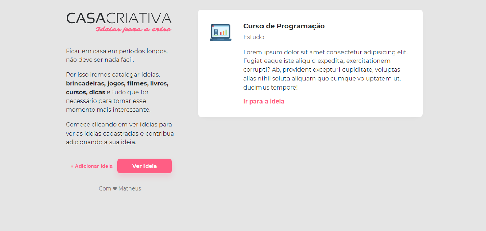
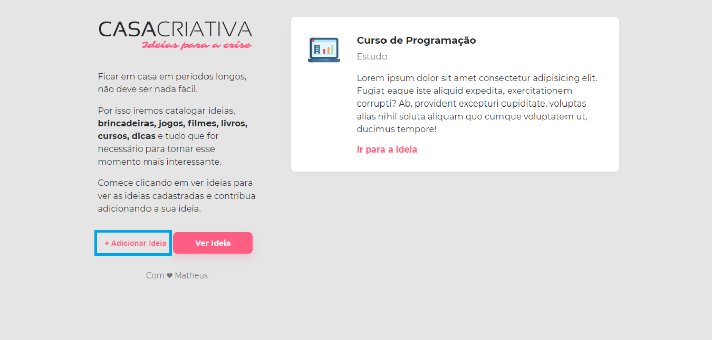
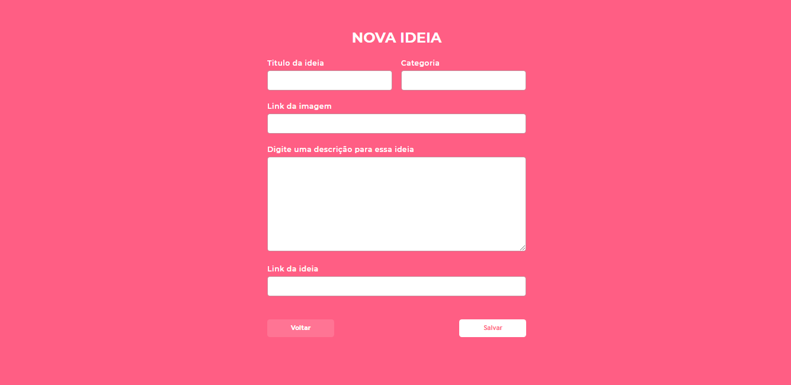
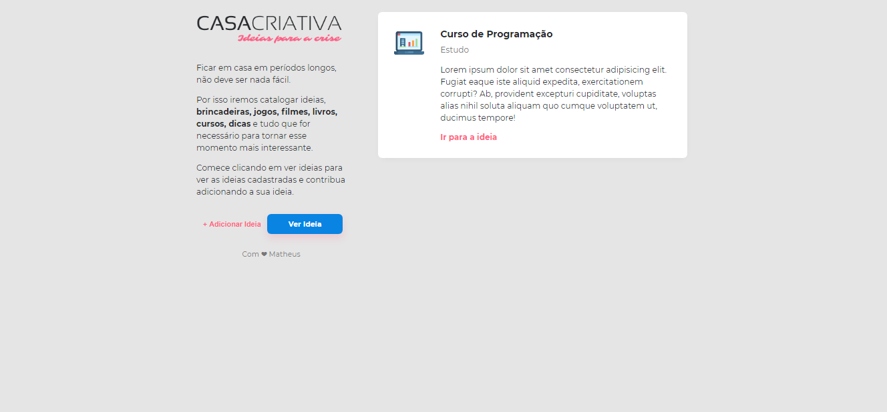
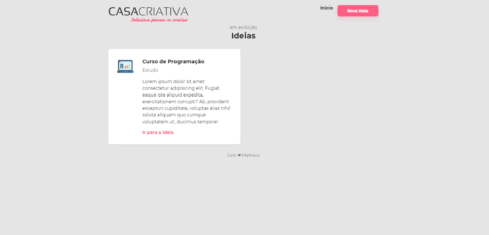
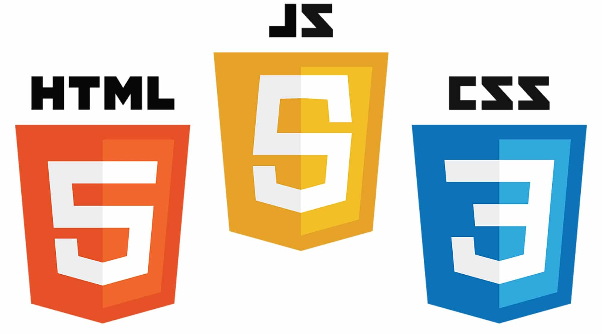
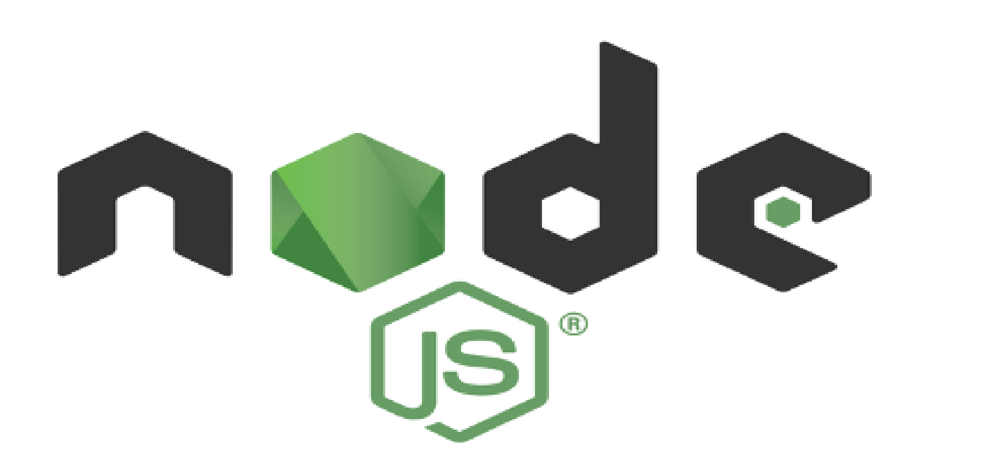
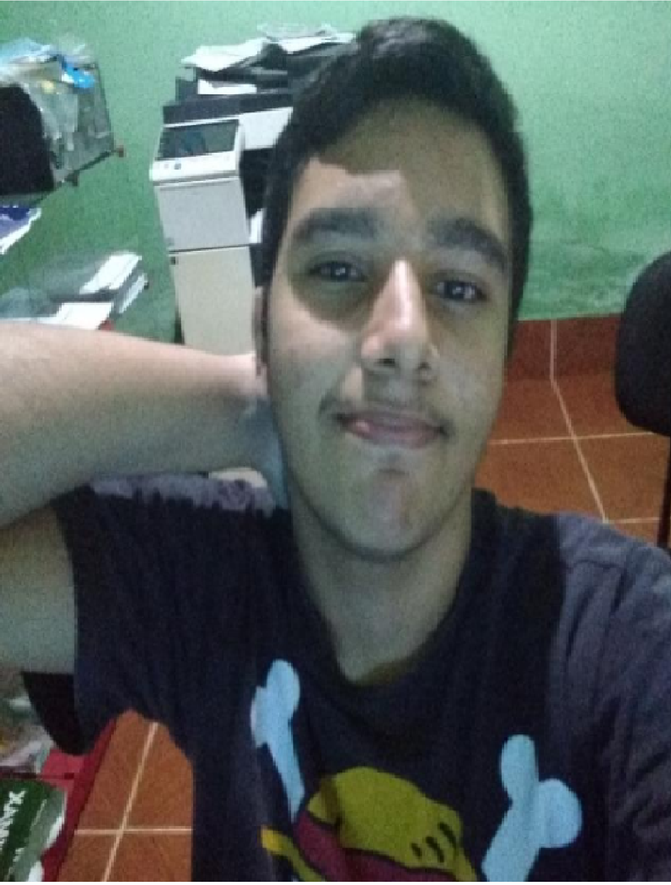

<h1 align = "center">
 
  
 

 

O projeto Casa Criativa, foi criado com o intuito de transformar esse momento de quarentena mais divertido!

  

    

    

    

    

    

<h2 align = "center">FRONT-END </h2> 

<ul>
    

<h3 align = "center">BACK-END</h3>

<ul>
    

<ul>
    

<h4>Template Engine</h4>
<ul>
  

## Getting started

para clonar e rodar essa aplicação, você vai precisar executar as seguintes tarefas:

Clonar esse repositório:
 - git clone https://github.com/matheuspaiva1/casa_criativa

Entrar no repositório:
 - cd casa_criativa-master/ws

Instalar as dependências:
 - npm install

Rodar o app:
 - npm run dev

Acessar a aplicação por:
 - http://localhost:3000

 
 

<strong> <h5 align = "center"> <a href = ""By: Matheus Paiva </h5> </strong>

<!-- git
-->
